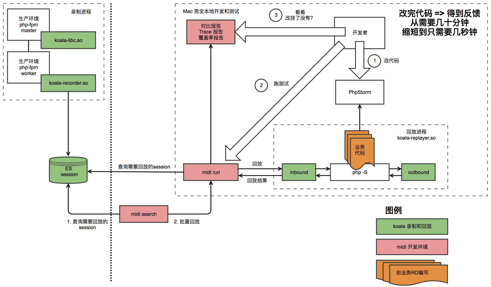

<h1 align="center">RDebug - Real Debugger</h1>

[](https://gitter.im/didi/rdebug?utm_source=badge&utm_medium=badge&utm_campaign=pr-badge)
[](https://github.com/didi/rdebug/blob/master/LICENSE)

## 一、简介

Rdebug 是滴滴开源的一款用于 RD 研发、自测、调试的实用工具，可以被用来提升 RD 研发效率、保障代码质量进而减少线上事故。

### 1.1 背景

鉴于微服务具有易于扩展、部署简单、技术异构性等优点，越来越多的服务都在采用微服务的架构模式。一个复杂的单体服务通常会被拆分成多个小的微服务，当然在享受微服务带来的一系列便利的同时也要接受因为微服务改造带来的问题：需要维护的服务数变多、服务之间 RPC 调用次数增加……

在服务化改造完成之后，原来的单体服务演化成一堆微服务，这就造成线下开发测试环境维护成本大大增加，其次线下环境涉及到的部门较多，维护一个长期稳定的线下环境也是一个挑战；业务快速发展、需求不断迭代，手写单测又因复杂的业务逻辑以及复杂的服务调用需要 mock 多个下游服务，导致手写单测成本特别的高；手动构造数据，又不够全面真实。以上问题都严重影响 RD 的研发效率，并且增加线上发生事故的隐患。

我们固执地相信这个行业需要一场变革。

### 1.2 宗旨

提升研发效率、降低测试成本、缩短产品研发周期，保障代码质量、减少线上事故。

### 1.3 适用场景

适用于对已有接口进行代码重构、功能升级，且该接口已经有录制的流量。

不适合新开发的接口 或 未进行流量录制的接口。

支持新接口的方案在调研中。

## 二、快速使用

### 录制流量

```shell
# 修改 php-fpm 配置，打开 `clear_env = no` 选项

# 编译 koala-libc.so 和 koala-recorder.so

# 启动 php-fpm 注入 koala-libc.so 和 koala-recorder.so
# 先设置环境变量
$ export KOALA_SO=/path/to/koala-recorder.so 
$ export KOALA_RECORD_TO_DIR=/path/to/your-save-recorded-session-dir
$ export LC_CTYPE="C"

# 启动 php-fpm 开始录制
# macOS
$ DYLD_INSERT_LIBRARIES="/path/to/koala-libc.so:/usr/lib/libcurl.dylib" DYLD_FORCE_FLAT_NAMESPACE="y" /path/to/sbin/php-fpm

# or, Linux
$ LD_PRELOAD="/path/to/koala-libc.so /usr/lib64/libcurl.so.4" /path/to/sbin/php-fpm
```

### 回放流量

回放支持 3 种方式：下载源码回放、midi.phar 包回放、composer bin 回放。

```shell
# 直接用源码回放
$ git clone https://github.com/didi/rdebug.git
$ cd rdebug/php/midi
$ sh install.sh
$ cd /path/to/your/project
$ /path/to/rdebug/php/midi/bin/midi run -f RECORD-SESSION-FILE

# 或，使用 phar 包回放
$ wget -O midi.phar -q https://github.com/didi/rdebug/raw/master/output/bin/midi.phar
$ midi.phar run -f RECORD-SESSION-FILE

# 或，Composer 全局安装 midi（相比安装到项目中，推荐全局安装）
$ composer global require rdebug/midi
$ cd /path/to/your/project
$ ~/.composer/vendor/bin/midi run -f RECORD-SESSION-FILE

# 或，Composer 安装到项目目录下
$ cd /path/to/your/project
$ composer require rdebug/midi --dev
$ ./vendor/bin/midi run -f RECORD-SESSION-FILE
```

### PHP 示例

- [使用 Docker 体验录制和回放](./doc/Docker.md)
- [PHP 录制和回放](./example/php/README.md)
- [PHP 回放本地文件](./doc/midi/Replay-file.md)
- [PHP 录制方案](./doc/recorder/recorder.md)

## 三、技术方案

因为我们需要使用线上的真实流量来进行线下的回放测试，所以我们需要将线上的真实流量保存下来，然后将保存的真实流量在线下环境进行回放一遍。故 Rdebug 的核心技术方案就是 **流量录制和流量回放**。

**流量录制**: 即录制线上服务的真实请求，包括调用下游服务的 RPC 请求。流量录制的难点在于如何将上下游请求以及每次 RPC 的请求/响应一一对应。

**流量回放**: 即用线上录制的流量，对线下测试代码进行回放，通过流量匹配 mock 掉下游 RPC 请求。因此，流量回放的难点在于请求的拦截和匹配。

整体架构图：



### 3.1 Koala & Koala-libc

Koala 和 Koala-libc 是 Rdebug 的核心引擎代码，是流量录制和回放的底层实现库。

流量回放是基于流量录制的代码实现，大部分流量录制需要关心的问题流量回放都需要关心，如 RPC 调用链跟踪、libc 拦截等。所以流量回放和录制共用同一套代码。

#### Koala

Koala 主体部分用 Go 编写，libc 系统调用拦截用少量的 C++ 编写，编译生成 koala-recorder.so(录制) 和 koala-replayer.so(回放) 两个 so 文件。

工作模式上分为录制和回放，回放的同时也在录制。

更多细节见 [koala](./koala/README.md) 。

#### Koala-libc

Koala-libc 使用 C 编写，编译生成 koala-libc.so 文件。

由于 Go 不支持 fork，为避免因为 PHP-FPM fork worker 引起的问题，先把 koala-libc.so 注入到 PHP-FPM 的父进程，在子进程 worker accept 的时候再把 koala-recorder.so 给加载进来。

这样 Koala-libc.so 会把 libc 系统调用拦截并转发给 koala-recorder.so。

更多细节见 [koala-libc](./koala-libc/README.md) 。

### 3.2 Midi

Midi 是 PHP 语言的流量回放客户端，以命令行形式回放流量。

内嵌 koala-replayer.so 文件，以命令行的方式、使用线上录制的流量，对线下代码进行回放，解析并对比回放结果，生成对比报告、Trace 报告、覆盖率报告等。

Midi 也支持 Xdebug 联动，对被测代码设置断点，进行单步调试，方便于研究代码和排查问题。

更多细节见 [midi](./php/midi/README.md) 。

## 四、编译

### 4.1 要求

#### Koala & Koala-libc

- GCC >= 4.8
- Go >= 1.8
- Glide

#### Midi

- macOS/Linux
- PHP >= 7.0
- Xdebug (可选)
- Composer（可选）

### 4.2 编译 Koala-libc

```
$ cd koala-libc
$ sh build.sh
```

将编译生成 `../output/libs/koala-libc.so`。

### 4.3 编译 Koala

```
$ cd koala

# install depends
$ sh build.sh vendor

# koala-recorder.so
$ sh build.sh recorder

# koala-replayer.so
$ sh build.sh
```

将编译生成 `../output/libs/koala-recorder.so` 和 `../output/libs/koala-replayer.so`。

### 4.4 编译 midi.phar

开始编译 phar 包之前，建议在当前环境下编译生成 `koala-replayer.so`，并存放到 `php/midi/res/replayer/koala-replayer.so`。

仓库中默认携带的 so ，只适用 macOS。

```
$ cd php/midi
$ sh build.sh
```

编译将会生成 `../output/bin/midi.phar`。

默认情况下，编译 phar 不包含 `DiPlugin`（php/midi/src/DiPlugin）插件。

DiPlugin 是滴滴内部的一个插件。如果需要包含 DiPlugin 插件，使用如下命令：

```
$ cd php/midi
$ sh build.sh midi-diplugin
```

## 五、使用

### 5.1 流量录制

流量录制 是在线上生产环境中，把真实的线上流量录制下来，存储到本地文件 或者 存储到 elastic 中。

通过 `KOALA_RECORD_TO_DIR` 环境变量，将录制的流量存储到指定的目录下。

macOS 和 Linux 下录制注入 so 的命令不同，分别是 `DYLD_INSERT_LIBRARIES` 和 `LD_PRELOAD`，其他环境变量和命令一致。

滴滴已在生产环境录制。更多 [录制介绍](./doc/recorder/recorder.md)。

#### 5.1.1 macOS 录制

```
$ DYLD_INSERT_LIBRARIES="/path/to/koala-libc.so:/usr/lib/libcurl.dylib" DYLD_FORCE_FLAT_NAMESPACE="y" LC_CTYPE="C" KOALA_SO=/path/to/koala-recorder.so KOALA_RECORD_TO_DIR=/tmp /usr/local/sbin/php-fpm
```

#### 5.1.2 Linux 录制

```
LD_PRELOAD="/path/to/koala-libc.so /usr/lib64/libcurl.so.4" LC_CTYPE="C" KOALA_SO="/path/to/koala-recorder.so" KOALA_RECORD_TO_DIR=/tmp /usr/local/sbin/php-fpm
```

Koala 也提供一种将流量写入到 elastic 的方式（仅供参考），只需要将环境变量 KOALA_RECORD_TO_DIR 替换成 KOALA_RECORD_TO_ES，值为 elastic 写入的 Url。

### 5.2 流量回放

流量回放 是使用线上录制好的流量，在本地环境（macOS 或者 linux）下回放，只需要部署当前模块的代码，不需要搭建下游依赖等环境。

下面介绍最简单的 `-f` 回放，指定录制的文件进行回放：

#### 5.2.1 回放

```Shell
# Source
$ /path/to/rdebug/php/midi/bin/midi run -f RECORD-SESSION-FILE

# Or, phar
$ midi.phar run -f RECORD-SESSION-FILE

# Or, composer vendor bin
$ ./vendor/bin/midi -f RECORD-SESSION-FILE
```

更多细节见 [流量回放](#回放流量)

如果回放失败，加上参数 -v、-vv 或 -vvv 查看详细日志。

#### 5.2.2 报告

参数 `-R`，`-T`，`-C` 等选项，支持生成报告：回放报告、Trace 报告、代码覆盖率报告等。

报告示例：


更多细节见 [Midi](./php/midi/README.md)。

## 六. 更多

### 6.1 翻译

* [English](./README.md)

### 6.2 文档列表

* [Documentation](./doc/DocList.md)
* [Wiki](https://github.com/didi/rdebug/wiki)

### 6.3 如何贡献

欢迎大家参与进来，更多细节见 [Contribute](./CONTRIBUTING.md)

### 6.4 联系我们

- QQ 群 726777992


### 6.5 许可

Rdebug is licensed under the Apache 2.0 License. [LICENSE](./LICENSE)

### 6.6 感谢

特别感谢 [TaoWen](https://github.com/taowen) Koala & Koala-libc 开发者。

[TanMingliang](https://github.com/TopN) WangBizhou FangJunda YangJing YangBochen LiXiaodong Midi 开发者。

特别感谢 Symfony、Xdebug、PHPUnit & Code Coverage、guzzlehttp 等开发者，提供如此好用的工具。

DingWei Wujun FanYitian ZhaoLu XuKaiwen HuXu FuYao HuMin 等同学的建议和帮助。
